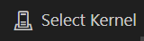
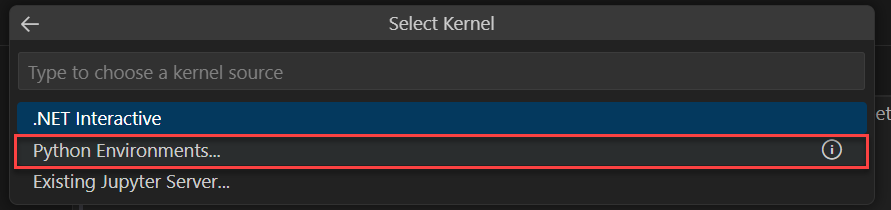
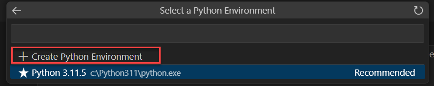
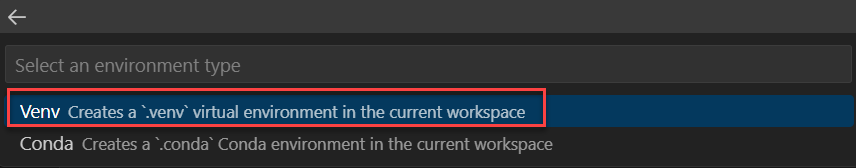
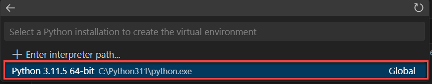
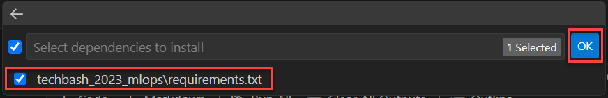

# Challenge 0: Convert a notebook to production code

## Review and run the existing notebook code

Review the existing notebook and run the cells in the notebook to understand what it is doing. Pay close attention to the cell where the data is being split (cells 4 and 9).

1. In Visual Studio Code, open the file **/experimentation/train-classification-model.ipynb**

2. In the upper-right corner of the notebook, select the **Select Kernel** button.

    

3. From the pallette drop-down, choose **Python Environments**.

    

4. From the pallette drop-down select **Create Python Environment**.

    

5. From the pallette drop-down select **Venv**.

    

6. From the pallette drop-down, select your python installation as the interpreter (your versions may vary).

    

7. In the pallette drop-down, select the **requirements.txt** that has been provided in the repository. Then press **OK**. This file installs the dependencies needed in the virtual environment to run the notebook.

    

8. Give it a few moments to create the virtual environment for the notebook.

9. Once the environment is complete, run each cell of the notebook and observe the output.

10. Save the file (along with the output) if desired.

## Modify train.py to refactor notebook code to a script

1. In Visual Studio Code, open the file **src/model/train.py**.

2. At the top of the file, import the namespace: `from sklearn.model_selection import train_test_split`.

3. Create the `split_data` function using code borrowed from the notebook:

    ```python
    def split_data(df):
        X, y = df[['Pregnancies','PlasmaGlucose','DiastolicBloodPressure','TricepsThickness','SerumInsulin','BMI','DiabetesPedigree','Age']].values, df['Diabetic'].values
        X_train, X_test, y_train, y_test = train_test_split(X, y, test_size=0.30, random_state=0)
        return X_train, X_test, y_train, y_test
    ```

4. To enable MLFlow autologging, at the top of the file, add the import: `import mlflow`

5. Add mlflow autologging: `mlflow.autolog()` where indicated in main. Final code listing for train.py:

    ```python
    # Import libraries

    import argparse
    import glob
    import os
    import mlflow
    import pandas as pd

    from sklearn.linear_model import LogisticRegression
    from sklearn.model_selection import train_test_split

    # define functions
    def main(args):
        # TO DO: enable autologging
        mlflow.autolog()

        # read data
        df = get_csvs_df(args.training_data)

        # split data
        X_train, X_test, y_train, y_test = split_data(df)

        # train model
        train_model(args.reg_rate, X_train, X_test, y_train, y_test)


    def get_csvs_df(path):
        if not os.path.exists(path):
            raise RuntimeError(f"Cannot use non-existent path provided: {path}")
        csv_files = glob.glob(f"{path}/*.csv")
        if not csv_files:
            raise RuntimeError(f"No CSV files found in provided data path: {path}")
        return pd.concat((pd.read_csv(f) for f in csv_files), sort=False)


    # TO DO: add function to split data
    def split_data(df):
        X, y = df[['Pregnancies','PlasmaGlucose','DiastolicBloodPressure','TricepsThickness','SerumInsulin','BMI','DiabetesPedigree','Age']].values, df['Diabetic'].values
        X_train, X_test, y_train, y_test = train_test_split(X, y, test_size=0.30, random_state=0)
        return X_train, X_test, y_train, y_test

    def train_model(reg_rate, X_train, X_test, y_train, y_test):
        # train model
        LogisticRegression(C=1/reg_rate, solver="liblinear").fit(X_train, y_train)


    def parse_args():
        # setup arg parser
        parser = argparse.ArgumentParser()

        # add arguments
        parser.add_argument("--training_data", dest='training_data',
                            type=str)
        parser.add_argument("--reg_rate", dest='reg_rate',
                            type=float, default=0.01)

        # parse args
        args = parser.parse_args()

        # return args
        return args

    # run script
    if __name__ == "__main__":
        # add space in logs
        print("\n\n")
        print("*" * 60)

        # parse args
        args = parse_args()

        # run main function
        main(args)

        # add space in logs
        print("*" * 60)
        print("\n\n")
    ```

6. In the terminal, navigate to the **src/model** directory.

7. Execute the following code to run the script:

    ```bash
    python train.py --training_data ../../experimentation/data
    ```

You have successfully completed Challenge 0 !
