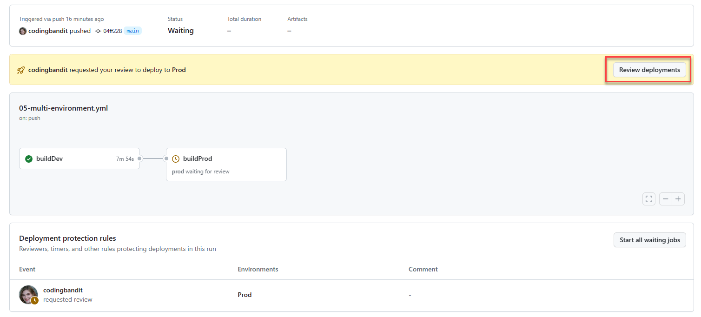
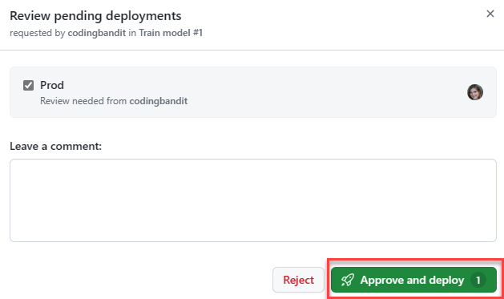

# Challenge 5: Work with environments

For the sake of time, we'll reuse our dev environment to include our production workloads.

## Create production dataset

Registering the dataset using the CLI pointing to a local file will automatically upload it to Azure Machine Learning storage.

1. Create the [challenge5_dataset.yml](../yml/challenge5_dataset.yml) file (source in-file). Note the name and the location points to the folder.

2. Register using the CLI:

    ```bash
    az ml data create --file challenge5_dataset.yml
    ```

## Add Dev and Prod environment configs on GitHub Repo

Before adding and configuring environments, we must remove the "global" azure credentials secret. Big Note! The repository must be set to public in order to see the **Environment protection rules**.

1. On the GitHub repo page, go to **Settings**.
2. Expand **Secrets and variables** (beneath the **Security** heading), and choose **Actions**.
3. Delete the **AZURE_CREDENTIALS** repository secret.

### Add a dev environment

1. Remaining on the Settings page, select **Environments** (beneath the **Code and automation heading).
2. Select **New environment**.
3. Name it **Dev**.
4. Select **Configure environment**.
5. Beneath **Environment secrets**, select **Add secret**.
6. Name the secret **AZURE_CREDENTIALS** and populate with the original credentials created in Challenge 2.

### Add a prod environment

1. Remaining on the Settings page, select **Environments** (beneath the **Code and automation heading).
2. Select **New environment**.
3. Name it **Prod**.
4. Select **Configure environment**.
5. Beneath **Environment secrets**, select **Add secret**.
6. Name the secret **AZURE_CREDENTIALS** and populate with the original credentials - if you are using a different AML environment, you would use the production service principal credentials here.

### Add Gatecheck reviewers

1. Remaining on the **Settings** page, select **Environments**.
2. Choose the **Prod** environment.
3. Under **Environment protection rules**, check **Required reviewers**.
4. Search for and select your GitHub Id.
5. Select **Save protection rules**.

## Create production job YAML file

1. Add new file **src/prod_job.yml** configured with production environment settings.

    ```yml
    $schema: https://azuremlschemas.azureedge.net/latest/commandJob.schema.json
    code: model
    command: >-
      python train.py
      --training_data ${{inputs.training_data}}
    inputs:
      training_data: 
        path: azureml:diabetes-prod-folder:1
        mode: ro_mount
      reg_rate: 0.01
    environment: azureml:AzureML-sklearn-1.0-ubuntu20.04-py38-cpu@latest
    compute: azureml:diabetes-cluster-cep
    experiment_name: challenge-5-experiment
    description: challenge 5 experiment
    ```

## Create multi-environment action/workflow

The workflow contains two jobs, one for dev and one for production. The production should not run unless dev was successful. The `--stream` value was added to ensure the CLI doesn't return until the job completes, and the `needs` is added to the production job so that it isn't executed unless the dev job completes successfully. Waiting for the job to queue and run will take some time, do not cancel the action. You can go into the dev or prod AML workspaces to see it's status.

Create the file `05-multi-environment.yml` in the **.github\workflows** folder.

```yml
name: Train model

on:
  push:
    branches: [ main ]

jobs:
  buildDev:
    runs-on: ubuntu-latest
    environment:
        name: dev 
    steps:
    - name: Check out repo
      uses: actions/checkout@main
    - name: Install az ml extension
      run: az extension add -n ml -y
    - name: Azure login
      uses: azure/login@v1
      with:
        creds: ${{secrets.AZURE_CREDENTIALS}}
    - name: Submit ML job
      run: az ml job create --file src/job.yml --resource-group diabetes-dev-rg --workspace-name aml-diabetes-dev --stream
  buildProd:
    runs-on: ubuntu-latest
    environment:
        name: prod
    needs: [ buildDev ]
    steps:
    - name: Check out repo
      uses: actions/checkout@main
    - name: Install az ml extension
      run: az extension add -n ml -y
    - name: Azure login
      uses: azure/login@v1
      with:
        creds: ${{secrets.AZURE_CREDENTIALS}}
    - name: Submit ML job
      run: az ml job create --file src/prod_job.yml --resource-group diabetes-dev-rg --workspace-name aml-diabetes-dev --stream
```

Issue a PR into main and you'll see that the GitHub action for the multi-environment deployment requires a manual deployment review. Open the Action (workflow job instance) - wait for the Dev job to finish, then initiate the deployment approval to Prod. The dev deployment may take some time depending on available resources in Azure. Feel free to start with the next challenge and come back to this later.




