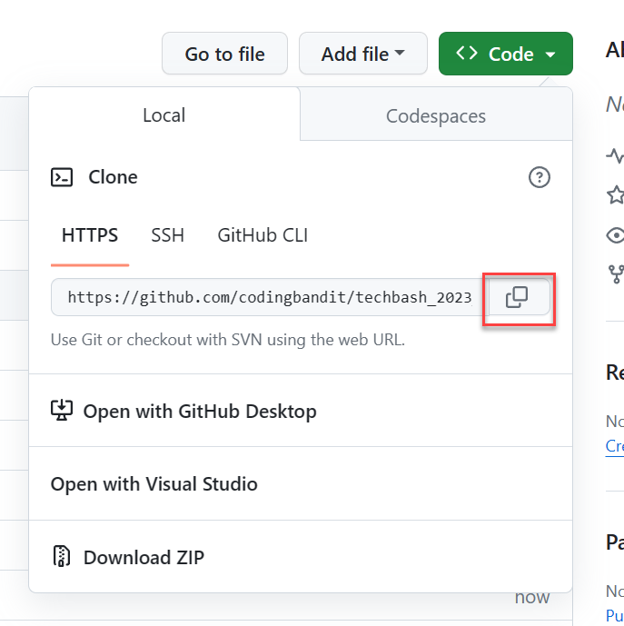

# Create the challenge repository

This exercise will walk you through creating a new repository for you to accomplish the challenges.

I have a PR into the Microsoft repository with some fixes. Until that is merged, please use my forked template.

## Create the repository from the template

1. Navigate to the [mslearn-mlops](https://github.com/codingbandit/mslearn-mlops) GitHub repository.

2. Expand the **Use this template** button and select **Create a new repository**.

    

3. On the **Create a new repository** screen, select your account as the owner and give a name to the repository, in this example `techbash_2023_mlops`. Ensure this repository remains public. Select **Create repository**.

    

4. Access the new repository in GitHub, expand the **Code** button and select to copy the URL to the clipboard.

    

5. On your local machine, create a folder where you'd like your challenge files to be located.

6. Using Visual Studio Code, open the folder you just created. Example: `D:\sourcecode\techbash_2023_mlops`.

7. In Visual Studio Code, open a terminal window (under the **View** menu or <kbd>CTRL</kbd>+<kbd>`</kbd>) and create a directory that you'd like to clone the repository to. In my case, I will create the folder .

8. In the terminal, clone the repository using the following command:

    ```bash
    git clone <URL_FROM_STEP_4>
    ```

You've now created the challenge repository and are ready to start the challenges!
